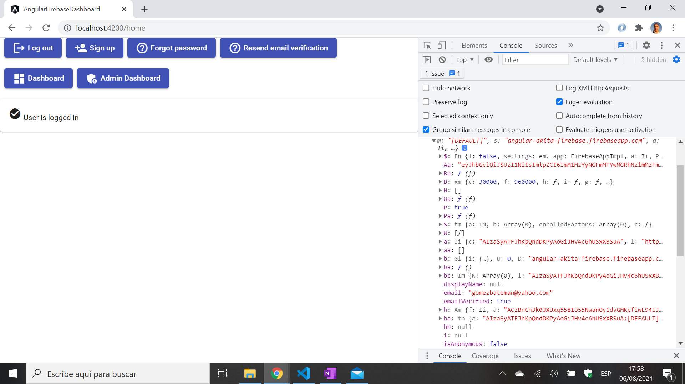

# Angular Firebase Dashboard

* Angular app with Firebase Authentication that displays a dashboard with login, logout, forgot-password etc. buttons & routing
* User details stored in a Cloud Firestore database
* Tutorial code from [D-I-Ry](https://www.youtube.com/channel/UCMHvK9tare9Y9O152C9wm3Q) with some modifications - see [:clap: Inspiration](#clap-inspiration) below
* **Note:** to open web links in a new window use: _ctrl+click on link_


## :page_facing_up: Table of contents

* [Angular Firebase Dashboard](#angular-firebase-dashboard)
  * [:page_facing_up: Table of contents](#page_facing_up-table-of-contents)
  * [:books: General info](#books-general-info)
  * [:camera: Screenshots](#camera-screenshots)
  * [:signal_strength: Technologies](#signal_strength-technologies)
  * [:floppy_disk: Setup](#floppy_disk-setup)
  * [:computer: Code Examples](#computer-code-examples)
  * [:cool: Features](#cool-features)
  * [:clipboard: Status & To-Do List](#clipboard-status--to-do-list)
  * [:clap: Inspiration](#clap-inspiration)
  * [:file_folder: License](#file_folder-license)
  * [:envelope: Contact](#envelope-contact)

## :books: General info

* [Firebase authentication](https://firebase.google.com/docs/auth) used to identify user
* This is not a practical auth. dashboard - too many buttons displayed. I had to modify the code not to display login and logout button together, for example.

## :camera: Screenshots



## :signal_strength: Technologies

* [Angular v12](https://angular.io/)
* [rxjs v6](https://rxjs.dev/) Reactive Extensions Library for JavaScript
* [firebase v8](https://firebase.google.com/) backend
* [@angular/fire v6](https://www.npmjs.com/package/@angular/fire) Angular library for Firebase.

## :floppy_disk: Setup

* Create project in Firebase console then add authentication.
* `npm i` to install dependencies
* `npm prune` to remove unused npm modules
* `ng serve` for a dev server. Navigate to `http://localhost:4200/`. The app will automatically reload if you change any of the source files.
* `ng update` to update Angular

## :computer: Code Examples - by [D-I-Ry](https://www.youtube.com/channel/UCMHvK9tare9Y9O152C9wm3Q) with some modifications

* login function that signs in user with details from html form

```typescript
  loginUser(email: string, password: string): Promise<any> {
    return this.afAuth
      .signInWithEmailAndPassword(email, password)
      .then(() => {
        console.log('Auth Service: loginUser: success');
        this.router.navigate(['/dashboard']);
      })
      .catch((error) => {
        console.log('Auth Service: login error code', error.code, error);
        if (error.code) return { isValid: false, message: error.message };
        return { isValid: true, message: 'no errors :-)' };
      });
  }
```

## :cool: Features

* 'Verify email' actually works and sends an email to the user with a link to click on. Refresh required to change boolean state on screen. Firebase backend code does make things easier.

## :clipboard: Status & To-Do List

* Status: Working
* To-Do: Nothing

## :clap: Inspiration

* [D-I-Ry: Angular & Firebase dashboard in 22 minutes](https://www.youtube.com/watch?v=HRaINOrhXbw&t=243s)

## :file_folder: License

* N/A

## :envelope: Contact

* Repo created by [ABateman](https://github.com/AndrewJBateman), email: gomezbateman@yahoo.com